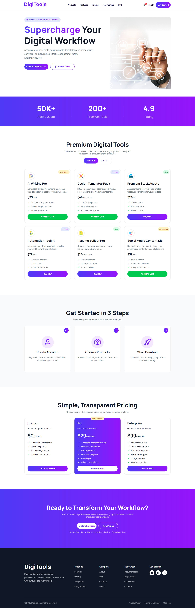

# 🚀 DigiTools Platform

This is an assignment project of MERN stack course in programming hero batch 13.

DigiTools Platform is a sleek, fully responsive e-commerce marketplace designed for purchasing premium digital products. From AI writing assistants to design templates, this platform provides a seamless "browse-to-buy" experience with a focus on modern UI/UX and smooth user interactions.

Live on Netlify - https://digitools-platform-zunaid.netlify.app/
 
 

## 🛠️ Technology Stack

### Frontend: React.js

### Styling: Tailwind CSS (for modern, utility-first styling)

### Notifications: React-Toastify (for real-time user feedback)

### Icons: HeroIcons

### Deployment: Netlify

 
 

## ✨ Key Features

### 1. 🛒 Interactive Cart Management

Users can easily add digital tools to their shopping cart or remove them with a single click. The cart state is managed efficiently to ensure a smooth shopping experience.

### 2. 📱 Fully Responsive Design

The platform is built with a mobile-first approach. Whether you are on a 4K monitor or a smartphone, the grid layouts (using grid-cols-2, grid-cols-3, etc.) and typography adapt perfectly to any screen size.

### 3. ✅ Simplified Checkout Flow

Experience a "one-click" checkout process. Upon clicking the checkout button, the system automatically clears the cart and triggers a "Purchase Complete" success toast via React-Toastify, simulating a real-world transaction flow without the complexity of payment gateways.

 
 

## 🚀 How to Run Locally

Clone the repository:

1. git clone https://github.com/ZunaidChowdhury/a6-PH-DigiTools-Platform
2. Install dependencies:
   npm install
3. Start the development server:
   npm run dev
   
 
 

# Desktop Version

  

